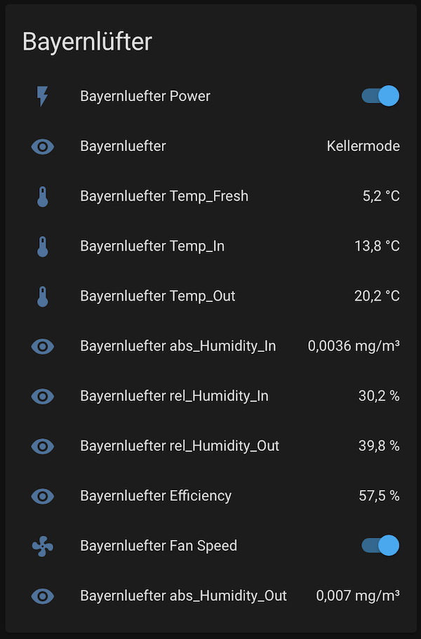
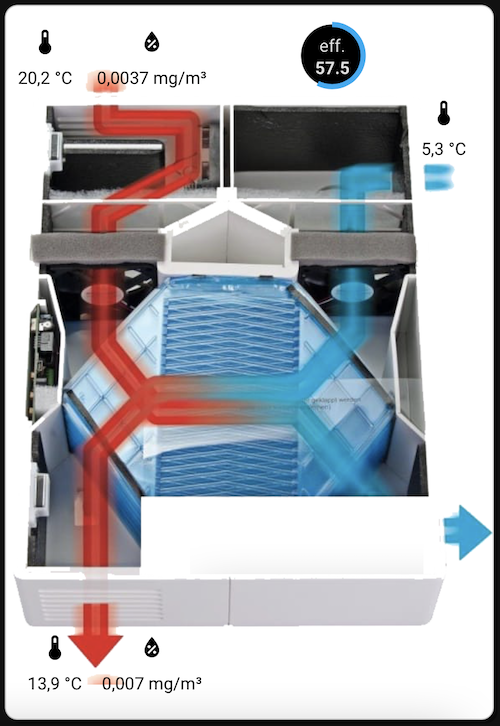

[](https://github.com/custom-components/hacs)

# Bayernlüfter Custom Component

A custom component for controlling the [Bayernlüfter](https://www.bayernluft.de/de/intro.htm) (Bayernluefter) via [home-assistant](home-assistant.io/).
The Bayernlüfter needs to have a WiFi-Module and additional humidity sensors installed (either the original [WiFi-Module](https://www.bayernluft.de/de/detailanzeige.cgi?suchen=TRUE&search_field=artikel&search_for=BV-WLN-2) and [Sensors](https://www.bayernluft.de/de/detailanzeige.cgi?suchen=TRUE&search_field=artikel&search_for=BV-FS-1) or the [DIY option](https://github.com/nielstron/diy_bayernluft)).

The component enables controlling the fan, monitoring humditity and toggling Power and Timer mode.

Example configuration.yaml

```yaml
bayernluefter:
    resource: http://192.168.178.5
    scan_interval: 30 # Optional scan interval in seconds
```

## Installation

Copy into your custom_components directory or install via [HACS](https://hacs.xyz/)

## The result:

Entities                   |  Custom Card
:-------------------------:|:-------------------------:
   |  


The second card which is taken from: https://github.com/arjenvrh/audi_connect_ha requires the following mods: 

https://github.com/thomasloven/lovelace-card-mod

https://github.com/custom-cards/circle-sensor-card

The background image is a svg image which does not have to be copied to the www folder, the relevant code was generated with: https://yoksel.github.io/url-encoder/ and minified with https://www.svgminify.com

and the following configuration:

```yaml
type: picture-elements
image: >-
  data:image/svg+xml,%3C%3Fxml version='1.0' encoding='UTF-8'%3F%3E%3Csvg
  width='136.28mm' height='168.23mm' version='1.1' viewBox='0 0 136.28 168.23'
  xmlns='http://www.w3.org/2000/svg' xmlns:cc='http://creativecommons.org/ns%23'
  xmlns:dc='http://purl.org/dc/elements/1.1/'
  xmlns:rdf='http://www.w3.org/1999/02/22-rdf-syntax-ns%23'
  xmlns:xlink='http://www.w3.org/1999/xlink'%3E%3Cdefs%3E%3ClinearGradient
  id='b' x1='119.69' x2='84.916' y1='154.73' y2='154.17'
  gradientUnits='userSpaceOnUse'%3E%3Cstop stop-color='%2307a3d8'
  offset='0'/%3E%3Cstop stop-color='%23a72c2c'
  offset='1'/%3E%3C/linearGradient%3E%3ClinearGradient id='a' x1='82.399'
  x2='119.82' y1='169.43' y2='170' gradientUnits='userSpaceOnUse'%3E%3Cstop
  stop-color='%23a72c2c' stop-opacity='.99761' offset='0'/%3E%3Cstop
  stop-color='%2307a3d8'
  offset='1'/%3E%3C/linearGradient%3E%3C/defs%3E%3Cmetadata%3E%3Crdf:RDF%3E%3Ccc:Work
  rdf:about=''%3E%3Cdc:format%3Eimage/svg+xml%3C/dc:format%3E%3Cdc:type
  rdf:resource='http://purl.org/dc/dcmitype/StillImage'/%3E%3Cdc:title/%3E%3C/cc:Work%3E%3C/rdf:RDF%3E%3C/metadata%3E%3Cg
  transform='translate(-46.367 -75.264)'%3E%3Cpath d='m85.801 128.8-27.781
  30.427 20.222 29.482 46.869-0.56697 21.167-23.812-26.836-34.774z'
  fill='%236da7c2' fill-opacity='.29412'/%3E%3Cpath d='m58.019 159.23 2.0789
  15.875 19.088 25.702 45.546-0.37798 19.277-21.923 2.2678-14.174-21.167
  23.812-46.869 0.56697z' fill='%236da7c2' fill-opacity='.615'/%3E%3Cpath
  d='m46.869 208.55 3.0238 12.662 11.3 0.0945m10.2-0.0623 82.822 0.15679
  4.7247-12.851' fill='none' stroke='%23000' stroke-linecap='square'
  stroke-linejoin='bevel'/%3E%3C/g%3E%3Cg transform='translate(-46.367
  -75.264)'%3E%3Cpath d='m161.47 102.28c-3.3505 0.0483-9.4978 0.0965-10.052
  0.14495m-1.8939-0.022c-1.6133 0.11583-9.4758 0.21408-14.214 0.32112l0.37798
  41.388-16.624 12.544-31.912-0.43225-20.935 15.587 0.04754 35.767m-0.01023
  2.1267 8.54e-4 17.323' fill='none' stroke='url(%23b)' stroke-linejoin='round'
  stroke-opacity='.315' stroke-width='8' style='paint-order:normal'/%3E%3Cpath
  d='m69.051 76.594-0.01822 5.7941m-0.0258 2.0953 0.03338 60.897 8.8379
  12.232m4.3732 7.699 1.9121 2.585 35.53 0.56696 27.339 27.618c3.2629 0.0541
  9.005 0.0578 9.8204-0.0271m2.3027-0.0623c0.72849-0.0761 4.8008 0.0904 7.144
  0.0974' fill='none' stroke='url(%23a)' stroke-linejoin='round'
  stroke-opacity='.26' stroke-width='8'/%3E%3Cpath d='m166.31
  186.88v18.344l16.343-9.4358z' fill='%2308a2d8'
  fill-opacity='.25882'/%3E%3Cpath d='m75.327 227.02-18.344 1e-5 9.4358 16.343z'
  fill='%23a62d2d' fill-opacity='.31373'/%3E%3C/g%3E%3Cg
  transform='translate(-46.367 -75.264)'%3E%3Cpath d='m53.484
  83.443h95.439l10.016 125.11h-112.07z' fill='none' stroke='%23000'
  stroke-linejoin='bevel' style='paint-order:fill markers
  stroke'/%3E%3C/g%3E%3C/svg%3E%0A
style: |
  ha-card {
    border-radius: 10px;
    margin: 5% 2em 2em 5%;
    padding: 15px;
  } 
elements:
  - type: icon
    icon: 'mdi:water-percent'
    entity: sensor.bayernluefter_abs_humidity_in
    tap_action: more_info
    style:
      color: black
      left: 30%
      top: 10%
  - type: state-label
    entity: sensor.bayernluefter_abs_humidity_in
    style:
      color: black
      left: 30%
      top: 15%
  - type: icon
    icon: 'mdi:eye'
    entity: sensor.bayernluefter
    tap_action: more_info
    style:
      color: black
      left: 40%
      top: 22%
  - type: state-label
    entity: sensor.bayernluefter
    style:
      color: black
      left: 40%
      top: 27%
  - type: icon
    icon: 'mdi:water-percent'
    entity: sensor.bayernluefter_abs_humidity_out
    tap_action: more_info
    style:
      color: black
      left: 30%
      top: 70%
  - type: state-label
    entity: sensor.bayernluefter_abs_humidity_out
    style:
      color: black
      left: 30%
      top: 75%
  - type: icon
    icon: 'mdi:thermometer'
    entity: sensor.bayernluefter_temp_out
    tap_action: more_info
    style:
      color: black
      left: 12%
      top: 10%
  - type: state-label
    entity: sensor.bayernluefter_temp_out
    style:
      color: black
      left: 12%
      top: 15%
  - type: icon
    icon: 'mdi:thermometer'
    entity: sensor.bayernluefter_temp_in
    tap_action: more_info
    style:
      color: black
      left: 10%
      top: 70%
  - type: state-label
    entity: sensor.bayernluefter_temp_in
    style:
      color: black
      left: 10%
      top: 75%
  - type: icon
    icon: 'mdi:thermometer'
    entity: sensor.bayernluefter_temp_fresh
    tap_action: more_info
    style:
      color: black
      left: 70%
      top: 15%
  - type: state-label
    entity: sensor.bayernluefter_temp_fresh
    style:
      color: black
      left: 70%
      top: 20%
  - type: 'custom:circle-sensor-card'
    entity: sensor.bayernluefter_efficiency
    max: 100
    min: 0
    stroke_width: 15
    gradient: true
    fill: '#0000'
    name: eff.
    units: ' '
    font_style:
      font-size: 1.0em
      font-color: white
      text-shadow: 1px 1px black
    style:
      top: 33%
      left: 32%
      width: 4em
      height: 4em
      transform: none
```

